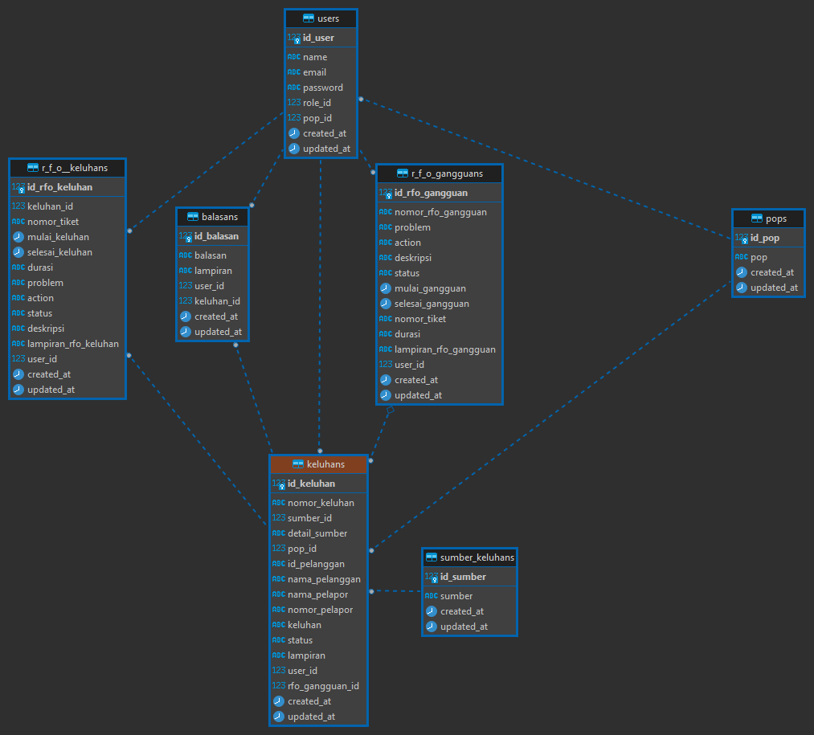

# REST API Customer care apps with Lumen PHP Framework

[](https://travis-ci.org/laravel/lumen-framework)
[](https://packagist.org/packages/laravel/lumen-framework)
[](https://packagist.org/packages/laravel/lumen-framework)
[](https://packagist.org/packages/laravel/lumen-framework)

This REST-API was built using Lumen Framework for Customer care application. </br>
Feature:
1. User
    - Register User
    - Login User
    - Logout User
    - Show Profile User
    - Edit Profile User

2. BTS
    - Show All BTS
    - Show One BTS
    - Create BTS (Admin only)
    - Update BTS (Admin only)
    - Delete BTS (Admin only)

3. Keluhan
    - Show All Keluhan
    - Show One Keluhan
    - Create Keluhan
    - Update keluhan
    - Delete Keluhan
    - Close Keluhan
    - Reopen Keluhan
    - Search History Keluhan

4. Balasan
    - Show All Balasan
    - Show One Balasan
    - Create Balasan

5. POP
    - Show All POP (Admin only)
    - Show One POP (Admin only)
    - Create POP (Admin only)
    - Update POP (Admin only)
    - Delete POP (Admin only)

6. Role
    - Show All Role (Admin only)
    - Show One Role (Admin only)
    - Create Role (Admin only)
    - Update Role (Admin only)
    - Delete Role (Admin only)

7. Sumber Keluhan
    - Show All Sumber Keluhan (Admin only)
    - Show One Sumber Keluhan (Admin only)
    - Create Sumber Keluhan (Admin only)
    - Update Sumber Keluhan (Admin only)
    - Delete Sumber Keluhan (Admin only)

8. User
    - Show All User (Admin only)
    - Show One User (Admin only)
    - Update User (Admin only)
    - Delete User (Admin only)

9. RFO Gangguan
    - Show All RFO Gangguan
    - Show One RFO Gangguan 
    - Update RFO Gangguan 
    - Search RFO Gangguan 
    
9. RFO Keluhan
    - Show All RFO Keluhan 
    - Show One RFO Keluhan 
    - Update RFO Keluhan 





Relation:
- Users with POP (One to Many) 
- Users with Role (One to Many)
- BTS with POP (Many to One)
- BTS with User (Many to One)
- Keluhan with POP (Many to One)
- Keluhan with User (Many to One)
- Keluhan with Balasan (One to Many)
- Balasan with User (Many to One)

Authentication:
- JWT Auth

Middleware:
- Admin
- NOC & Helpdesk


------------------------------------------------------------------------
## Endpoints
#### User
</br>`POST:http://localhost:8000/api/register`
</br>`POST:http://localhost:8000/api/login`
</br>`GET:http://localhost:8000/api/logout`
</br>`GET:http://localhost:8000/api/update`


#### BTS
</br>`GET:http://localhost:8000/api/bts`
</br>`POST:http://localhost:8000/api/bts`
</br>`GET:http://localhost:8000/api/bts/{id}`
</br>`DELETE:http://localhost:8000/api/bts/{id}`
</br>`PUT:http://localhost:8000/api/bts/{id}`

#### Keluhan
</br>`GET:http://localhost:8000/api/keluhan`
</br>`POST:http://localhost:8000/api/keluhan`
</br>`GET:http://localhost:8000/api/keluhan/{id}`
</br>`DELETE:http://localhost:8000/api/keluhan/{id}`
</br>`PUT:http://localhost:8000/api/keluhan/{id}`

#### Balasan
</br>`GET:http://localhost:8000/api/balasan`
</br>`GET:http://localhost:8000/api/balasan/{id}`
</br>`POST:http://localhost:8000/api/balasan`


------------------------------------------------------------------------
## Implementations
1. Create Postgre or MySQL database</br>

2. Clone Repository </br>
    ```
    git clone https://github.com/FarhanKurnia/REST-API-CCO-LUMEN.git
    ```

3. Install Composer </br>
    ```
    composer install
    ```

4. Create JWT Secret </br>
    ```
    php artisan jwt:secret
    ```

5. Copy and Set up environment</br>
    ```
    cp .env.example .env
    ```

6. Customize environment (.env) files with DB name that has been created.</br>

7. Install your extension of PHP (Ubuntu) depend on what the db that you use (optional) </br>
    ```
    sudo apt-get install php7.4-pgsql
    ```

8. Migrate and seed table</br>
    ```
    php artisan migrate --seed
    ```

9. Run local server</br>
    ```
    php -S localhost:8000 -t public
    ```
